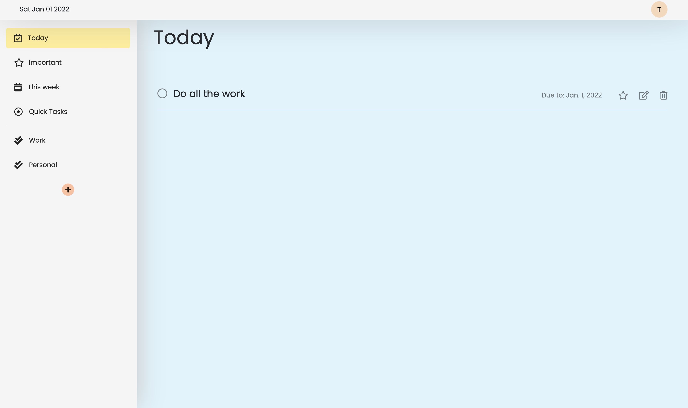

# Django Todo Web Application

This is a ToDo web application created with Django Web Framework. 

## Features:

* Creating accounts
* Today tasks
* Important Tasks
* This week tasks
* Quick Tasks
* Up to 100 custom todo lists
* List and Task editing
* List sorting
* Password reset

## Technologies:

Project created with:
* Django
* PostgreSQL
* Docker
* Bootstrap and Sortable.js extensions

# todo_test
